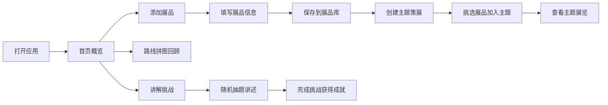

## 1. 产品概述

博物馆小策展人是一款面向亲子家庭和中小学生的博物馆参观辅助工具，帮助用户边逛博物馆边记录展品、构建主题展览、回顾参观路线，并通过讲解挑战加深对展品的理解与记忆。

- 核心目的：解决博物馆参观"看完就忘"的问题，通过互动式记录和游戏化策展，让参观者主动思考、深度参与
- 目标用户：6-14岁中小学生及其家长，博物馆爱好者
- 产品价值：将被动参观转化为主动探索，培养观察力、表达力和策展思维

## 2. 核心功能

### 2.1 用户角色

| 角色 | 登录方式 | 核心权限 |
|------|----------|----------|
| 普通用户 | 本地存储（无需登录） | 收藏展品、创建策展、生成路线、完成挑战 |

### 2.2 功能模块

1. **首页**：数据总览、快捷入口、每日灵感
2. **展品卡收藏**：展品列表、添加展品、展品详情、标签管理
3. **主题策展**：主题列表、创建主题、添加/移除展品、主题展示墙
4. **路线拼图**：参观地图、时间轴回顾、路线分享
5. **讲解挑战**：随机出题、讲述提示、完成记录

### 2.3 页面详情

| 页面名称 | 模块名称 | 功能描述 |
|-----------|-------------|---------------------|
| 首页 | 数据概览 | 展示已收藏展品数、策展数、参观天数等成就数据 |
| 首页 | 快捷入口 | 四个核心功能的彩色卡片入口 |
| 首页 | 今日灵感 | 随机推荐一个策展主题或展品标签 |
| 展品卡收藏 | 展品列表 | 卡片式展示所有收藏的展品，支持按标签筛选 |
| 展品卡收藏 | 添加展品 | 表单填写：名称、年代、材质、印象标签、拍照/上传图片、备注 |
| 展品卡收藏 | 展品详情 | 展示展品完整信息，可编辑和删除 |
| 主题策展 | 主题列表 | 展示已创建的主题展览卡片，每个卡片显示封面和展品数量 |
| 主题策展 | 创建主题 | 输入主题名称、选择主题分类（颜色/动物/器物/科技/自定义）、选择封面色 |
| 主题策展 | 主题详情 | 展示主题下的所有展品，支持添加/移除展品，可拖拽排序 |
| 路线拼图 | 参观地图 | 以时间轴+地图拼图的方式展示参观顺序，每个节点是一个展品卡 |
| 路线拼图 | 参观记录 | 按日期分组的参观历史，可查看某天的完整路线 |
| 讲解挑战 | 挑战选择 | 三种难度：新手/小讲解员/策展大师，不同数量的讲述任务 |
| 讲解挑战 | 出题页面 | 随机抽取展品，给出讲述提示和要点，倒计时功能 |
| 讲解挑战 | 成就记录 | 记录完成的挑战次数和连续打卡天数 |

## 3. 核心流程

用户打开应用 → 浏览首页数据概览 → 点击"添加展品"记录新展品 → 填写展品信息（名称、年代、材质、标签）→ 保存到展品库 → 创建主题策展 → 从展品库中挑选展品加入主题 → 参观结束后查看路线拼图回顾 → 参与讲解挑战练习讲述 → 获得成就感

## 4. 用户界面设计

### 4.1 设计风格

- **整体风格**：童趣博物馆风，温暖活泼，带有手账/剪贴簿质感
- **主色调**：暖琥珀色 #D4A574 作为主色，搭配奶油白 #FFF8F0 背景
- **辅助色**：
  - 薄荷绿 #7FB77E（展品卡收藏）
  - 珊瑚粉 #FF8A8A（主题策展）
  - 天空蓝 #89CFF0（路线拼图）
  - 薰衣紫 #B19CD9（讲解挑战）
- **卡片风格**：圆角 16px，带有轻微纸张纹理和阴影，模拟博物馆说明牌质感
- **按钮风格**：圆润饱满，带有轻微悬浮效果，点击有缩放反馈
- **字体**：标题使用圆润活泼的字体，正文清晰易读
- **图标风格**：手绘风格线条图标，搭配emoji增强童趣感
- **装饰元素**：贴纸效果、胶带纸、图钉、手写字体点缀，营造手账氛围

### 4.2 页面设计概述

| 页面名称 | 模块名称 | UI 元素 |
|-----------|-------------|-------------|
| 首页 | 数据概览 | 大数字展示 + 图标徽章，暖色调渐变背景 |
| 首页 | 快捷入口 | 四个彩色功能卡片，2x2 网格布局，每个卡片有独特的图标和渐变色 |
| 首页 | 今日灵感 | 便签纸样式卡片，手写体标题，每日随机推荐 |
| 展品卡收藏 | 展品列表 | 瀑布流/网格布局卡片，每张卡片像博物馆藏品说明牌 |
| 展品卡收藏 | 添加按钮 | 悬浮圆形 + 按钮，带有脉冲动画 |
| 主题策展 | 主题列表 | 封面墙式布局，每个主题像一个小展览入口 |
| 主题策展 | 主题详情 | 展品横向排列，可滑动浏览，顶部有主题横幅 |
| 路线拼图 | 时间轴 | 垂直时间轴，节点用展品缩略图，有连线串联 |
| 讲解挑战 | 挑战卡片 | 三种难度卡片，颜色逐级加深，有星级评分 |
| 讲解挑战 | 出题界面 | 聚光灯效果，展品图片居中，下方有讲述提示条 |

### 4.3 响应式设计

- **移动端优先**：针对手机屏幕优化，单列布局为主
- **触摸友好**：按钮和可点击区域不小于 44x44px
- **手势支持**：支持左右滑动切换展品、下拉刷新
- **平板适配**：在平板上可展示两列或三列内容
- **底部导航**：四个 Tab 底部导航栏，带图标和文字标签

### 4.4 动效与交互

- **页面切换**：轻微的淡入淡出 + 位移动画
- **卡片悬浮**：鼠标/触摸时卡片轻微上浮，阴影加深
- **添加动效**：添加展品时卡片从底部滑入，带有弹性效果
- **成就弹窗**：完成挑战时出现庆祝动画（彩带、星星）
- **路线绘制**：进入路线页面时，时间轴节点逐个出现，连线有绘制动画
