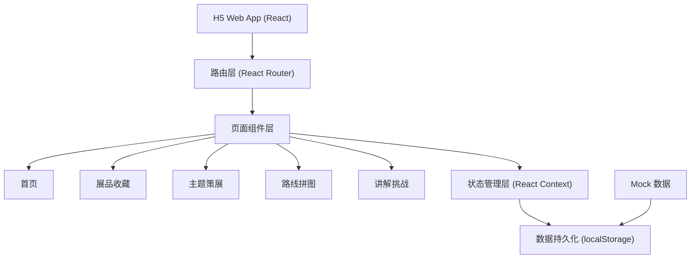
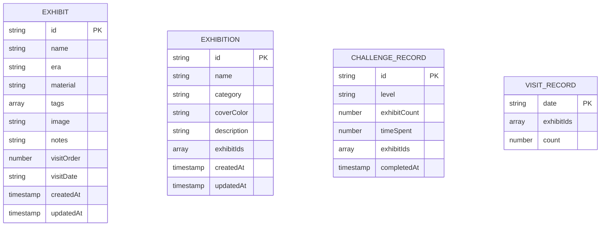

## 1. 架构设计

本项目为纯前端 H5 应用，采用本地存储方案，无需后端服务，数据保存在浏览器 localStorage 中。



## 2. 技术选型

- **前端框架**：React 18 + TypeScript
- **构建工具**：Vite 5
- **样式方案**：Tailwind CSS 3
- **路由管理**：React Router v6
- **状态管理**：React Context + useReducer
- **数据存储**：localStorage（本地持久化）
- **图标库**：Lucide React（线性图标，轻量现代）
- **动画库**：Framer Motion（流畅的交互动画）
- **图片处理**：原生 File API + Canvas（图片压缩）
- **Mock 数据**：内置示例展品数据，首次访问自动初始化

## 3. 路由定义

| 路由路径 | 页面名称 | 说明 |
|---------|----------|------|
| `/` | 首页 | 数据概览 + 快捷入口 + 今日灵感 |
| `/collection` | 展品收藏 | 展品列表 + 筛选 + 添加按钮 |
| `/collection/add` | 添加展品 | 展品信息填写表单 |
| `/collection/:id` | 展品详情 | 展品完整信息展示与编辑 |
| `/exhibitions` | 主题策展 | 主题列表 + 创建入口 |
| `/exhibitions/create` | 创建主题 | 主题信息填写表单 |
| `/exhibitions/:id` | 主题详情 | 主题展品展示与管理 |
| `/route` | 路线拼图 | 参观时间轴与路线回顾 |
| `/challenge` | 讲解挑战 | 挑战选择与成就展示 |
| `/challenge/play` | 挑战进行中 | 随机抽题讲述界面 |

## 4. 数据模型

### 4.1 数据模型定义



### 4.2 数据结构说明

**Exhibit（展品）**
- `id`: 唯一标识符（UUID）
- `name`: 展品名称
- `era`: 年代（如"唐代"、"新石器时代"）
- `material`: 材质（如"青铜"、"陶瓷"、"玉石"）
- `tags`: 印象标签数组（如["金色", "龙纹", "礼器"]）
- `image`: 展品图片（base64 或默认图片）
- `notes`: 备注/个人感想
- `visitOrder`: 当天参观顺序
- `visitDate`: 参观日期（YYYY-MM-DD）
- `createdAt`: 创建时间
- `updatedAt`: 更新时间

**Exhibition（主题展览）**
- `id`: 唯一标识符
- `name`: 主题名称
- `category`: 分类（color/animal/artifact/tech/custom）
- `coverColor`: 封面颜色（色值）
- `description`: 主题描述
- `exhibitIds`: 包含的展品ID数组（有序）
- `createdAt`: 创建时间
- `updatedAt`: 更新时间

**ChallengeRecord（挑战记录）**
- `id`: 唯一标识符
- `level`: 难度等级（beginner/intermediate/expert）
- `exhibitCount`: 讲述展品数量
- `timeSpent`: 用时（秒）
- `exhibitIds`: 涉及的展品ID
- `completedAt`: 完成时间

**VisitRecord（参观记录）**
- `date`: 参观日期
- `exhibitIds`: 当天参观的展品ID（按顺序）
- `count`: 展品数量

## 5. 目录结构

```
src/
├── assets/              # 静态资源（图片、图标等）
├── components/          # 通用组件
│   ├── BottomNav.tsx    # 底部导航
│   ├── ExhibitCard.tsx  # 展品卡片
│   ├── TagBadge.tsx     # 标签徽章
│   └── PageHeader.tsx   # 页面头部
├── pages/               # 页面组件
│   ├── Home/            # 首页
│   ├── Collection/      # 展品收藏
│   ├── Exhibition/      # 主题策展
│   ├── Route/           # 路线拼图
│   └── Challenge/       # 讲解挑战
├── context/             # 状态管理
│   ├── ExhibitContext.tsx
│   └── ThemeContext.tsx
├── types/               # TypeScript 类型定义
│   └── index.ts
├── utils/               # 工具函数
│   ├── storage.ts       # 本地存储封装
│   ├── mockData.ts      # Mock 数据
│   └── helpers.ts       # 通用工具
├── styles/              # 全局样式
│   └── index.css
├── App.tsx
└── main.tsx
```

## 6. 技术要点

1. **本地存储封装**：统一的 localStorage 读写接口，支持数据版本迁移
2. **图片压缩**：上传图片时自动压缩，减少存储占用
3. **响应式设计**：移动端优先，适配不同屏幕尺寸
4. **动画性能**：使用 CSS 动画和 transform，确保 60fps 流畅度
5. **数据初始化**：首次访问时自动注入 Mock 示例数据，演示完整功能
6. **无障碍设计**：适当的对比度、语义化标签、键盘导航支持
